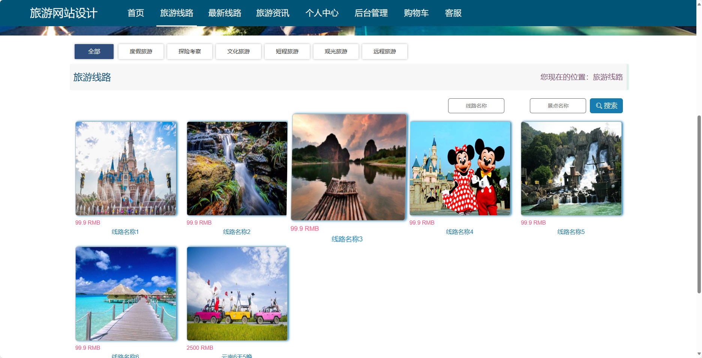
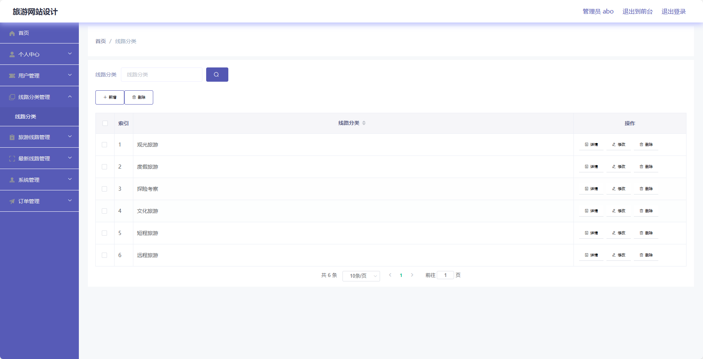

## 基于SpringBoot的旅游网站(程序+报告)

- <b>完整代码获取地址：从戎源码网 ([https://armycodes.com/](https://armycodes.com/))</b>
- <b>技术探讨、资料分享，请加QQ群：692619798</b> 
- <b>作者微信：19941326836  QQ：952045282</b> 
- <b>承接计算机毕业设计、Java毕业设计、Python毕业设计、深度学习、机器学习</b>
- <b>选题+开题报告+任务书+程序定制+安装调试+论文+答辩ppt 一条龙服务</b>
- <b>所有选题地址 ([https://github.com/YuLin-Coder/AllProjectCatalog](https://github.com/YuLin-Coder/AllProjectCatalog)) </b>

## 项目介绍
基于SpringBoot的旅游网站，系统包含两种角色：管理员、用户,系统分为前台和后台两大模块，主要功能如下。

### 【管理员】:
- 个人中心：管理员可以查看和编辑个人信息，包括修改密码等。
- 用户管理：管理员可以管理系统的用户账号，包括添加、编辑和删除用户。
- 线路分类管理：管理员可以管理旅游线路的分类，包括添加、编辑和删除分类。
- 旅游线路管理：管理员可以管理旅游线路的信息，包括添加、编辑和删除线路。
- 最新线路管理：管理员可以管理最新发布的旅游线路，包括添加、编辑和删除最新线路。
- 系统管理：管理员可以管理系统的其他配置信息，包括网站公告、参数设置等。
- 订单管理：管理员可以查看和处理用户的订单，包括确认订单、取消订单等操作。

### 【前台】:
- 首页：展示旅游网站的核心内容，包括推荐的旅游线路、最新的旅游资讯等。
- 旅游线路：展示各类旅游线路，包括线路名称、线路介绍、价格等信息。
- 最新线路：展示最新发布的旅游线路，方便用户了解最新的旅游信息。
- 旅游资讯：提供最新的旅游资讯、游记分享等内容，方便用户获取旅游相关的信息。
- 个人中心：用户可以在个人中心管理自己的个人信息，包括修改密码、查看订单等。
- 购物车：用户可以将感兴趣的旅游线路加入购物车，方便统一结算。
- 客服：提供在线客服功能，方便用户在遇到问题时进行咨询和反馈。

### 【用户】:
- 个人中心：用户可以查看和编辑个人信息，包括修改密码等。
- 我的收藏管理：用户可以管理自己收藏的旅游线路信息，包括查看收藏、取消收藏等操作。
- 订单管理：用户可以查看和管理自己的订单，包括查看订单详情、取消订单等操作。

## 项目技术
- 编程语言：Java
- 数据库：MySQL
- 项目管理工具：Maven
- 前端技术：HTML、CSS、JavaScript、Jquery、Vue
- 后端技术：Spring、SpringMVC、MyBatis

## 运行环境
- JDK版本：JDK1.8及以上
- 开发工具：IDEA、Ecplise、Myecplise都可以
- 数据库: MySQL5.7及以上
- Maven：maven3.0及以上
- Node：14.14.0及以上

## 运行截图

